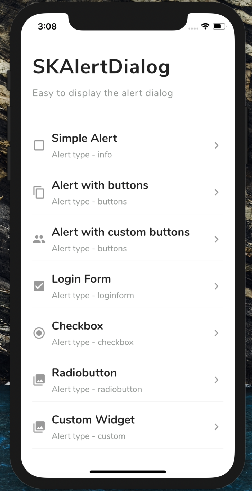
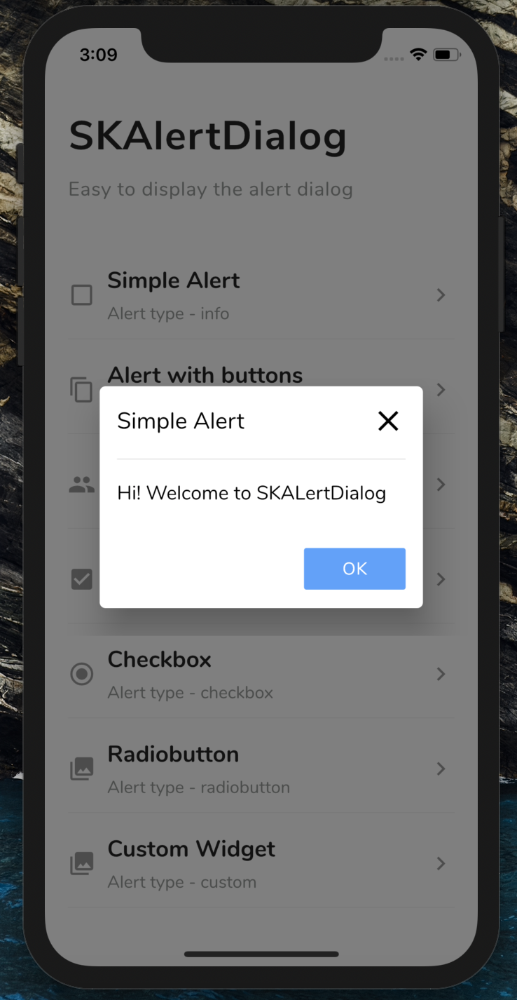
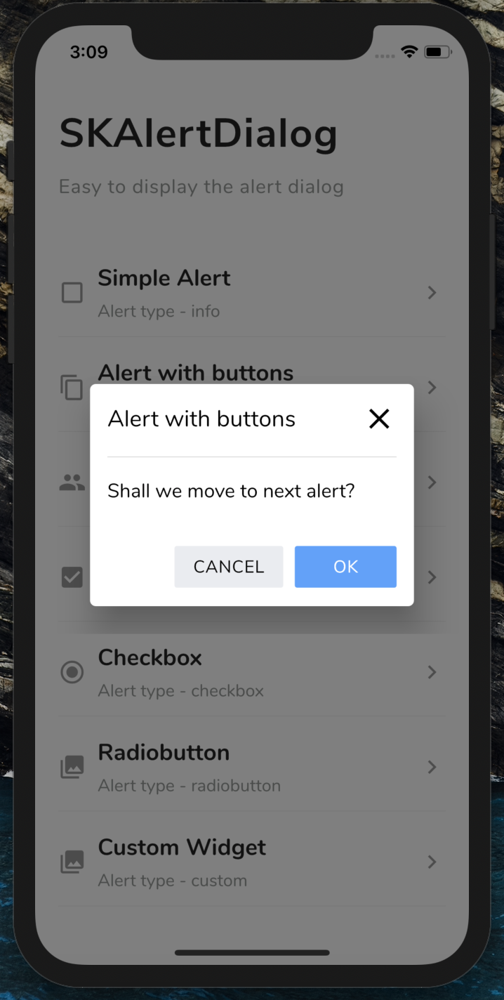
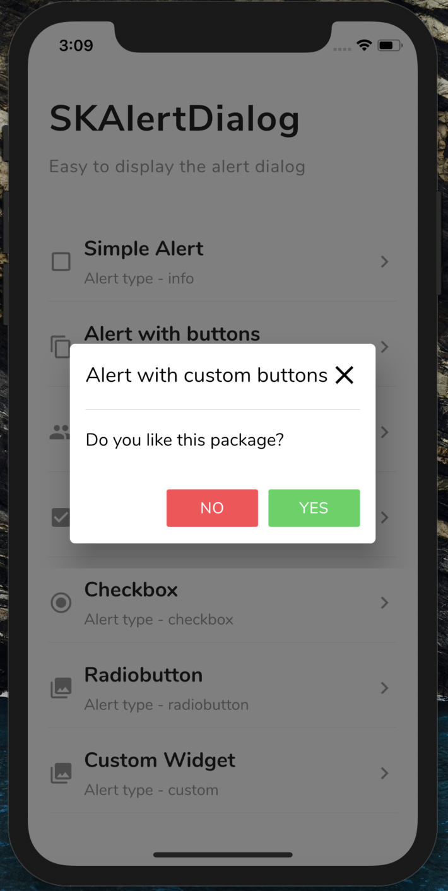
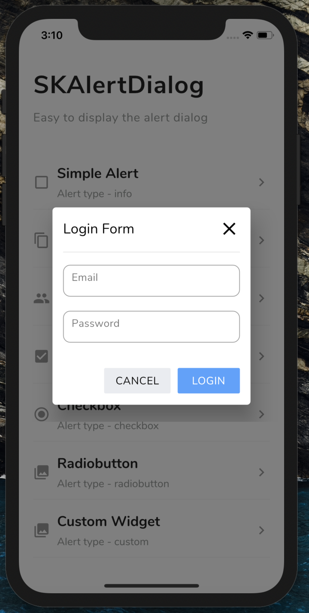
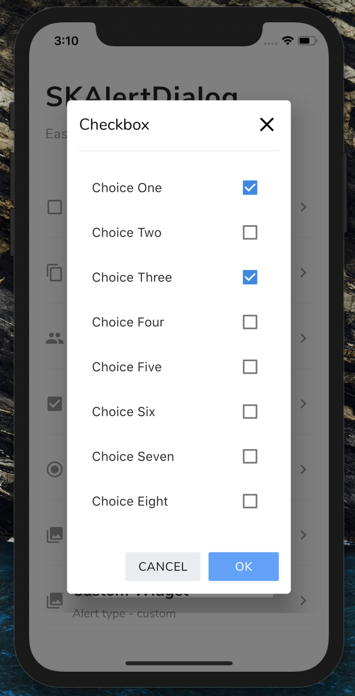
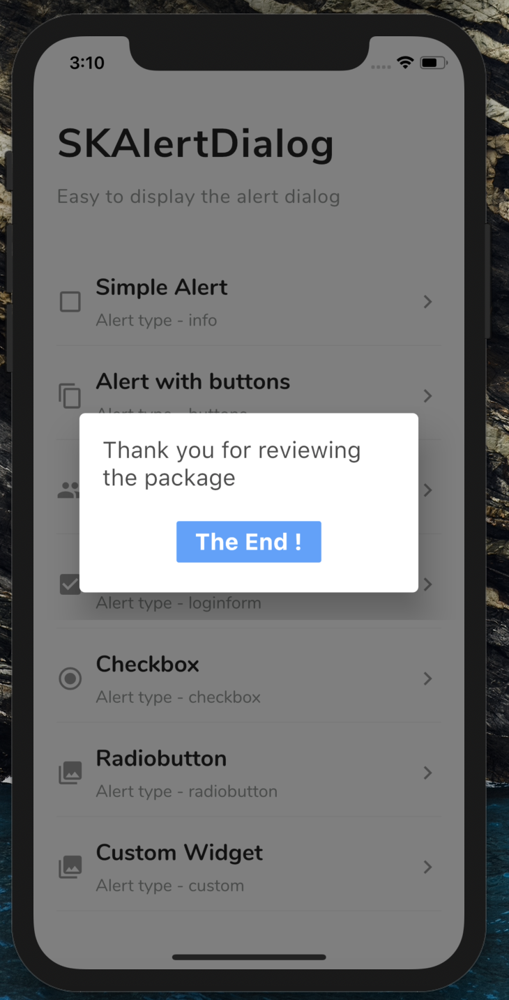

# SKAlertDialog
 
A highly customizable, powerful and easy-to-use alert dialog for Flutter.
  
 [](https://flutter.dev/)
 [](https://pub.dev/packages/status_alert)
 
## GIF

<p align="left">
  
</p>

## Screenshots

SKAlertDialog              |  Basic Alert               | Alert with buttons     |  Alert with custom buttons 
:-------------------------:|:-------------------------:|:-------------------------:|:-------------------------:
||||

Login Form                 |  Checkbox                  | Radio button             |  Custom Dialog 
:-------------------------:|:-------------------------:|:-------------------------:|:-------------------------:
||||


## 💻 Installation

You just need to add `sk_alert_dialog` as a [dependency in your pubspec.yaml file.](https://flutter.dev/docs/development/packages-and-plugins/using-packages)

```yaml
dependencies:
sk_alert_dialog: ^1.0.0
```

## Usage

### Import this class

```dart
import 'package:sk_alert_dialog/sk_alert_dialog.dart';
```

## Simple Alert

```dart
     SKAlertDialog.show(
        context: context,
        type: SKAlertType.info,
        title: 'Simple Alert',
        message: 'Hi! Welcome to SKALertDialog',
        onOkBtnTap: (value) {
          print('Okay Button Tapped');
        },
      );
```

## Alert with buttons

```dart
    SKAlertDialog.show(
        context: context,
        type: SKAlertType.buttons,
        title: 'Alert with buttons',
        message: 'Shall we move to next alert?',
        onOkBtnTap: (value) {
          print('Okay Button Tapped');
        },
        onCancelBtnTap: (value) {
          print('Cancel Button Tapped');
        },
      );
```

## Alert with custom buttons

```dart
   SKAlertDialog.show(
        context: context,
        type: SKAlertType.buttons,
        title: 'Alert with custom buttons',
        message: 'Do you like this package?',
        okBtnText: 'YES',
        okBtnTxtColor: Colors.white,
        okBtnColor: const Color(0xFF3BD459),
        cancelBtnText: 'NO',
        cancelBtnTxtColor: Colors.white,
        cancelBtnColor: const Color(0xFFFF4954),
        onOkBtnTap: (value) {
          print('Okay Button Tapped');
        },
        onCancelBtnTap: (value) {
          print('Cancel Button Tapped');
        },
      );
```

## Login Form

```dart
  SKAlertDialog.show(
        context: context,
        type: SKAlertType.loginform,
        title: 'Login Form',
        okBtnText: 'LOGIN',
        onOkBtnTap: (value) {
          print('Okay Button Tapped');
        },
        onCancelBtnTap: (value) {
          print('Cancel Button Tapped');
        },
        onEmailTextFieldChanged: (value) {
          print('On Email Text Changed $value');
        },
        onPasswordTextFieldChanged: (value) {
          print('On Password Text Changed $value');
        },
      );
```

## Checkbox

```dart
    SKAlertDialog.show(
        context: context,
        type: SKAlertType.checkbox,
        checkBoxAry: {'Choice One': true, 'Choice Two': false, 'Choice Three': true, 'Choice Four': false, 'Choice Five': false},
        title: 'Checkbox',
        onCancelBtnTap: (value) {
          print('Cancel Button Tapped');
        },
        onCheckBoxSelection: (value) {
          print('onCheckBoxSelection $value');
        },
      );
```

## Radio button

```dart
    SKAlertDialog.show(
        context: context,
        type: SKAlertType.radiobutton,
        radioButtonAry: {'Choice One': 1, 'Choice Two': 2, 'Choice Three': 3, 'Choice Four': 4, 'Choice Five': 5},
        title: UtilsImporter().stringUtils.radio_button_alert_title,
        onCancelBtnTap: (value) {
          print('Cancel Button Tapped');
        },
        onRadioButtonSelection: (value) {
          print('onRadioButtonSelection $value');
        },
      );
```

## Custom Dialog

```dart
    SKAlertDialog.show(
        context: context,
        type: SKAlertType.custom,
        customWidget: customWidget(),
      );
```

### Create the custom widget

```dart
  Widget customWidget() { 
     return new Padding(
        padding: EdgeInsets.only(left: 20, right: 20, top: 20, bottom: 20),
        child: Column(
          crossAxisAlignment: CrossAxisAlignment.start,
          children: <Widget>[
            Text(
              'Thank you for reviewing the package',
              style: TextStyle(
                  fontWeight: FontWeight.w400,
                  color: Theme.of(context).primaryColorDark.withOpacity(0.7),
                  fontSize: 20),
            ),
            SizedBox(height: 20),
            Row(
              mainAxisAlignment: MainAxisAlignment.center,
              children: <Widget>[
                FlatButton(
                  color: const Color(0xFF50A1FF),
                  onPressed: () {
                    Navigator.of(context).pop();
                  },
                  child: Text(
                    'The End !',
                    style: TextStyle(
                        fontWeight: FontWeight.w700,
                        color: Colors.white,
                        fontSize: 20),
                  ),
                )
              ],
            ),
          ],
        ));
  }
```

## 📃License

    Copyright 2020, Senthil Kumar

    Licensed under the Apache License, Version 2.0 (the "License");
    you may not use this file except in compliance with the License.
    You may obtain a copy of the License at

       http://www.apache.org/licenses/LICENSE-2.0

    Unless required by applicable law or agreed to in writing, software
    distributed under the License is distributed on an "AS IS" BASIS,
    WITHOUT WARRANTIES OR CONDITIONS OF ANY KIND, either express or implied.
    See the License for the specific language governing permissions and
    limitations under the License.
